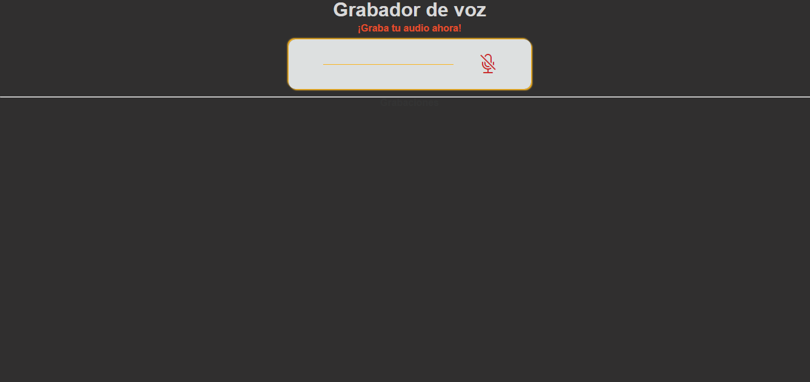
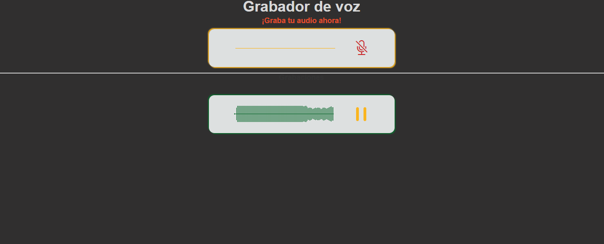
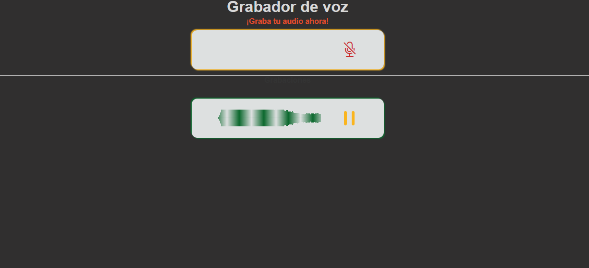

## Grabador de Voz
- Proyecto basico de grabaciones de audio

- Técnologias usadas
  
  - HTML
  - CSS
  - JAVASCRIPT

### Inicia tu grabación. 

### Una vez finalizada veras tu grabación lista para ser escuchada.

### Dale play y escuchate. 

### Cuenta con analisis de voz y animacion con css y javascript.

### clonar: https://github.com/braiandevcode/Grabador_Voz.git

